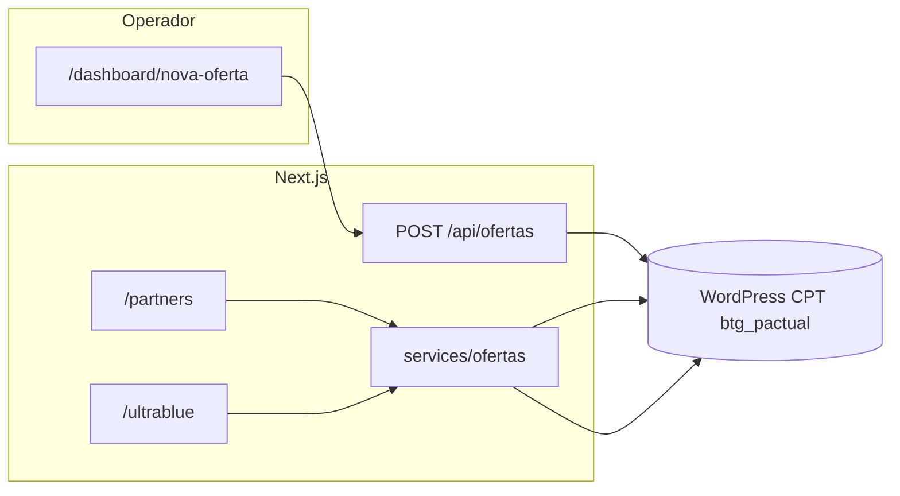

# BTG Dashboard — arquitetura

## Fluxo de dados

1. **Operador** preenche o formulário em **`/dashboard/nova-oferta`** e envia `multipart/form-data` para **`POST /api/ofertas`**.
2. A **API Route** (`app/api/ofertas/route.ts`) envia a imagem ao WordPress (`/wp-json/wp/v2/media`), depois cria o post no CPT **`btg_pactual`** com os campos ACF, incluindo **`tipo_cartao`** (`Partners` ou `Ultrablue`).
3. As **landings públicas** leem as ofertas via **`services/ofertas.ts`**: requisição GET ao REST do WordPress e **filtro em memória** por `tipo_cartao` usando `getOfertasPorTipoCartao()` e os valores em **`constants/cartoes.ts`**.

## Rotas

| Caminho | Função |
|--------|--------|
| `/` | Hub com links para Partners, Ultrablue e cadastro |
| `/partners` | LP completa (hero, seções, curadoria); ofertas dinâmicas na seção **Escolhas do nosso Concierge** |
| `/ultrablue` | Lista só ofertas com ACF `tipo_cartao` = Ultrablue |
| `/dashboard/nova-oferta` | Formulário do operador |
| `/nova-oferta` | Redireciona permanentemente para `/dashboard/nova-oferta` |

## Pastas principais

| Pasta | Conteúdo |
|-------|----------|
| `app/` | Rotas App Router: páginas, layouts, API |
| `app/api/ofertas/` | Criação de oferta no WP |
| `components/ofertas/` | UI reutilizável (ex.: `OfertaCard`) |
| `components/partners/` | Blocos da home Partners (`PartnersHeader`, `PartnersHero`, `PartnersCuratedOffers`, …) |
| `constants/partners-lp.ts` | URLs das imagens estáticas da LP (Unsplash); trocar por assets em `public/` se quiser |
| `constants/` | Valores fixos compartilhados (`TIPO_CARTAO`) |
| `services/` | Chamadas ao WordPress e filtros |
| `types/` | Tipos TypeScript (`Oferta`) |

## Design (Partners)

Referência Figma: [LP_PARTNERS_Desktop_v4](https://www.figma.com/proto/BBWDpqydRizxCSFWaLGwm0/LP_PARTNERS_Desktop_v4--Copy-?node-id=1-14). A rota `/partners` implementa a estrutura da home (header, hero, intro, curadoria com cards do WordPress, banners, benefícios, CTA, rodapé). E-mail do CTA final: opcional `NEXT_PUBLIC_PARTNERS_CONCIERGE_EMAIL` (senão usa fallback em `PartnersClosingCta`).

## Evolução possível

- **Filtro no WordPress** (meta query na REST) se o volume de posts crescer.
- **Autenticação** no dashboard (hoje a rota é pública).
- **Variantes visuais** de `OfertaCard` por cartão (props ou CSS variables).
